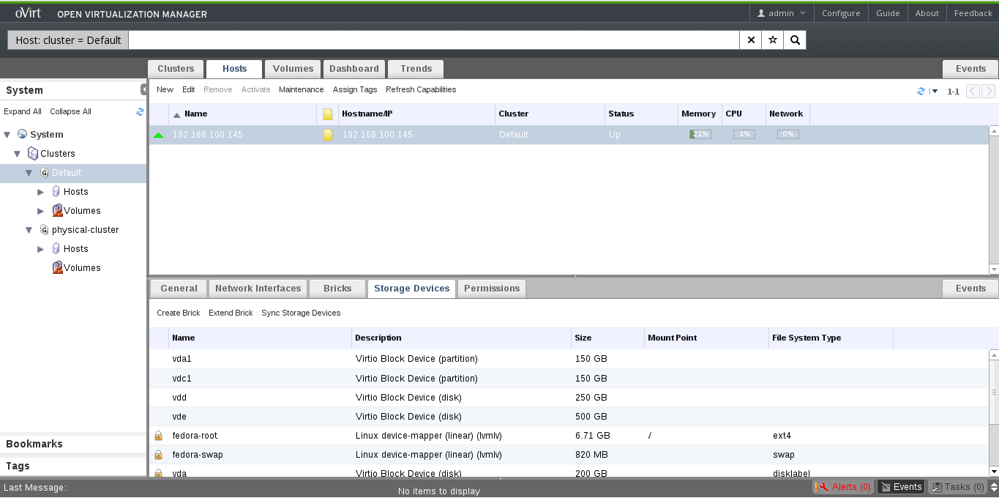
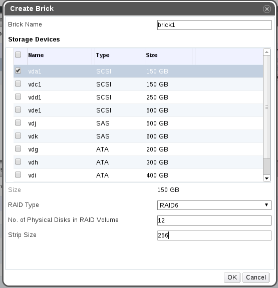
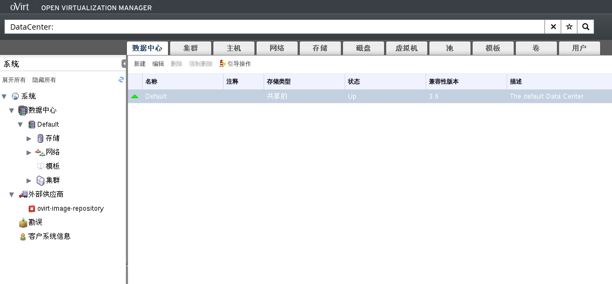
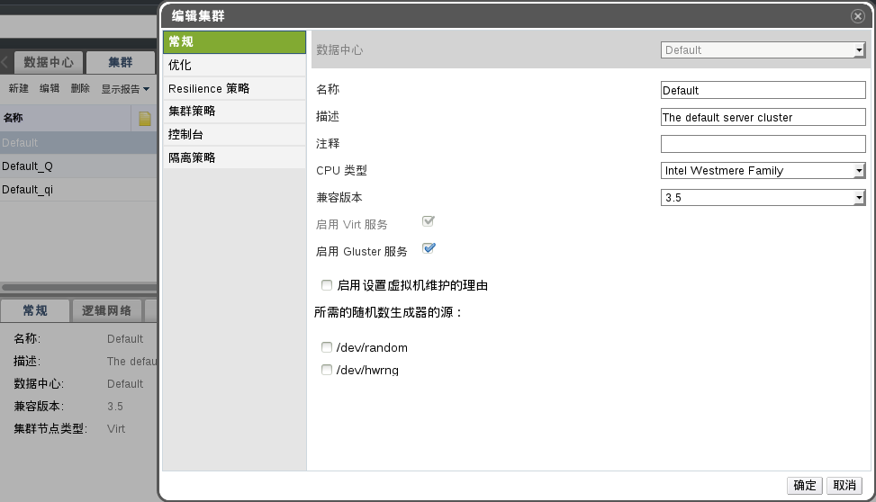
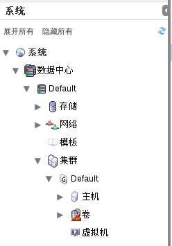
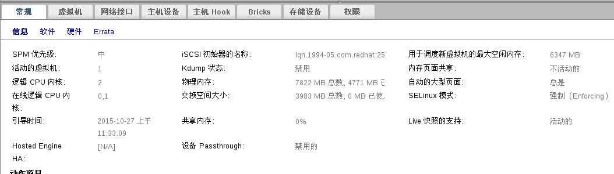
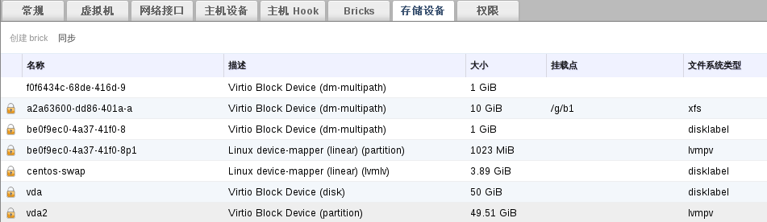
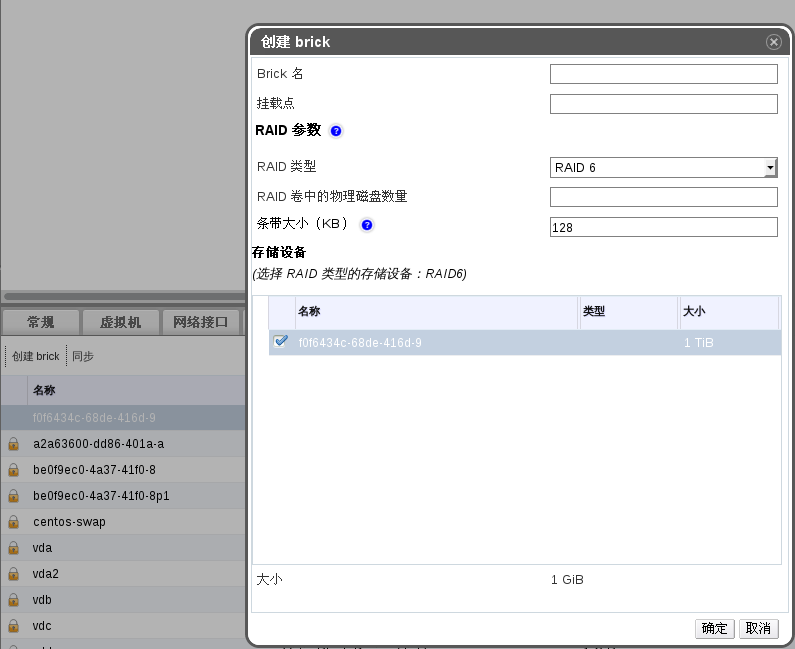
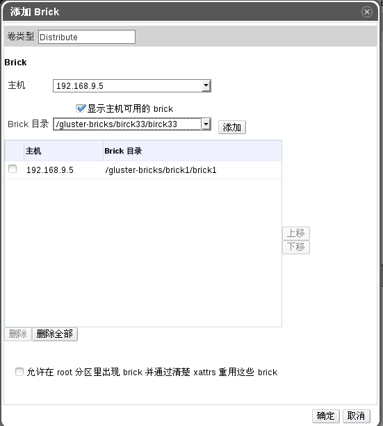

#使用Gluster管理主机和磁盘
###主机设备管理
####总结
这个功能可以控制主机上的磁盘和存储设备，在Gluster集群中，可以识别bricks。配置包括
<ol><li> 确定磁盘和存储设备不存在文件系统</li><li>使用这些brick设备通过新的逻辑卷创建新的brick或者通过扩大逻辑卷来扩大存在的brick</li><li>如果有必要可以选择xfs或其他文件系统格式对逻辑卷</li><li>更新这个条目的逻>辑卷</li><li>挂载这个逻辑卷</li></ol>
这个功能可以适用于新添加的主机或新添加的磁盘和现有主机的存储设备中
####研发者
* 功能研发者：Balamurugan Arumugam
* GUI组件研发者：Ramesh Nachimuthu
* Engine组件研发者：Ramesh Nachimuthu
* VDSM研发者:Timothy Asir
* QA研发者：

####当前状态
* 状态：已完成
* 最新更新日期：

###细节描述
####存储设备列表
在主机详细面板下添加了一个“储存设备“新的选项卡，这个选项卡将会列出错有选中主机的存储设备,所有可以供给gluster卷使用的空存储设备都将被放在列表最上面，剩下已经被使用的设备将出现一个象征锁，并且放到列表的最下边。

   

####创建brick
在创建卷的时候存在添加brick选项卡，点击选项卡将会弹出添加brick的页面，用户可以选择他想要的存储设备来创建brick。
   
   

当用户点击OK会发生以下事情

  1. New Physical Volume(PV) will be created with the selected storage
  2. New Volume group (VG) will be created with PV created in step 1
  3. New Thin Pool will be created in the VG
  4. New Logical Volume (LV)  will be created in the Thin Pool.
  5. LV created in step 4 will be formatted using XFS file system with the required performance configurations
  6. LV will be mounted on the folder /rhs-bricks/'<brick-name>.'

####扩展Brick

在储存设备选项卡里存在一个扩展brick的选项，这个选项能够帮助你扩展存在的LV以及在LV里的文件系统。这是一个在线操作，在使用卷的brick的时候不会出现任何中断。

####改变brick的选择

这个功能使创建卷与为存在的卷添加brick变的更加简单也使的为每个主机显示bricks列表变的更加有意义。现在直接选择比打字写出路径变的更加的简单。下面是添加brick的新窗口。

   

###详细设计

引用URl:[http://www.ovirt.org/Features/Design/GlusterHostDiskManagement](http://www.ovirt.org/Features/Design/GlusterHostDiskManagement)详细功能特性的介绍。

###依赖/相关功能和项目
none

##测试用例0110001
* 测试步骤

  1.进入管理平台管理员门户如下图所示：

   

  2.点**系统**的**数据中心**里的**集群**的**编辑**项，会弹出编辑集群窗口，如图所示：
   

  3.选择启用Gluster服务，默认不启动，点击确定，可以看到选择改变的集群出现一个G图案，如图所示：

   

  4.向该集群内添加 EayunOS 宿主机，如果在设置集群为 gluster 集群之前，该集群已经有 EayunOS 宿主机，则进入**主机**选项卡，选择已有宿主机，点击**维护**，之后点击**重新安装**等待完成，并且主机处于up状态。

  5.此时点击**主机**选项卡，在详细列表里出现**存储设备**选项。如图所示：

    

  6.点击**存储设备**选项，将会给你列出主机存在的所有存储，未被使用的存储放到类表上面，使用的存储则出项一个象征锁，放到列表下，如图所示：

    

  7.选择未被使用的存储设备，这时可以未存储创建Brick，点击**创建Brick**，弹出创建窗口，如图所示：

    

  8.根据添加的brick的名字，系统自动挂载到/gluster-bricks下.

  9.再次点击**卷**的**add Brick**可以看到存在的brick方便你的使用。如图所示：

    

