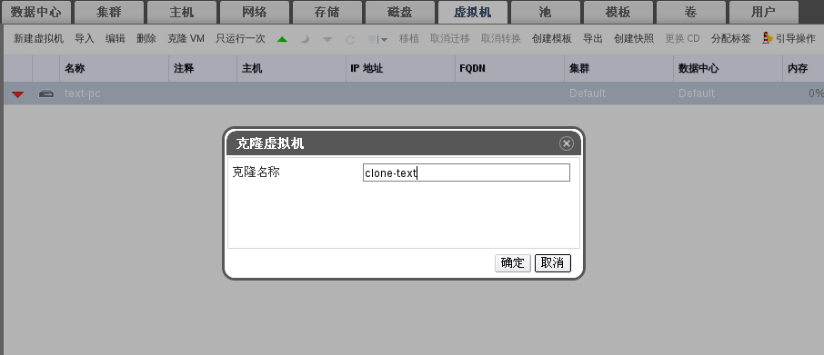
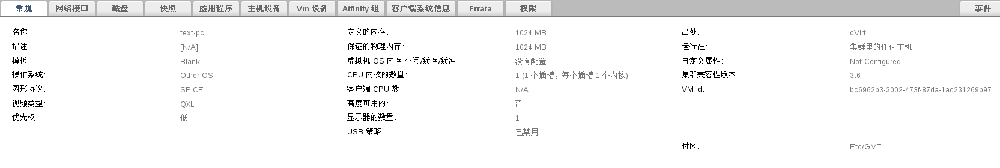
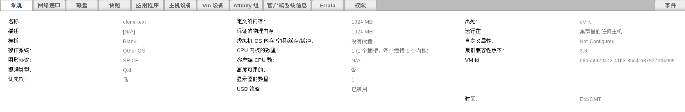
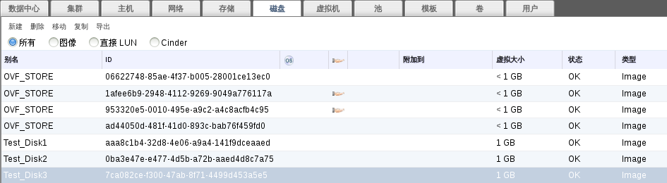
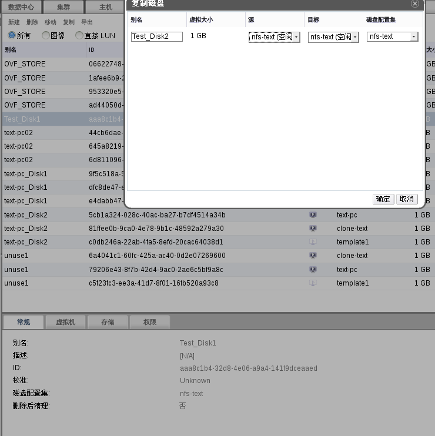
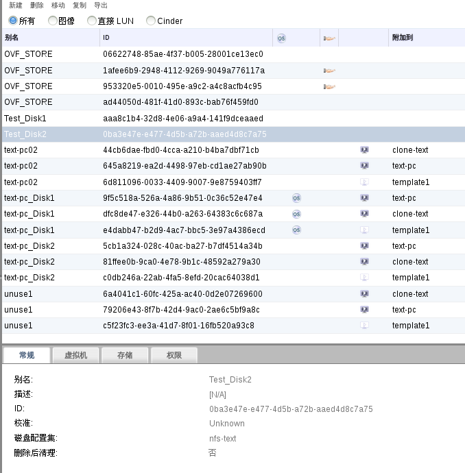
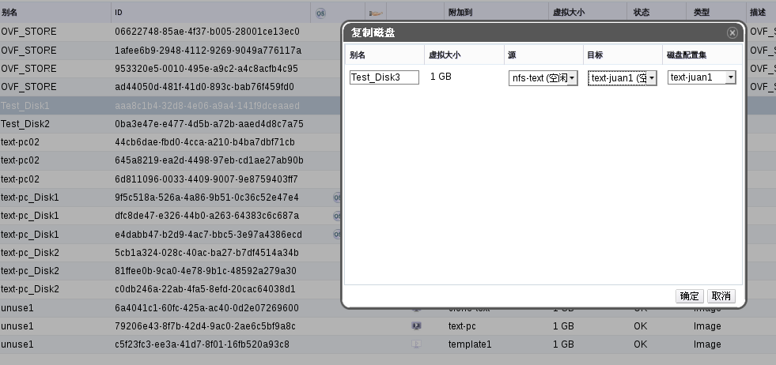
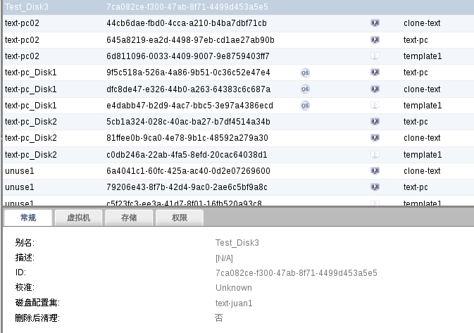

##复制磁盘
###总结
直到ovirt 3.5的出现，之前复制虚拟机只有通过模版，复制虚拟机也只能在不通的存储域。REF可以自由的复制虚拟机和浮动磁盘在不通或是相同的存储域中。

###研发者
* name:[Tomas Jelinek](http://www.ovirt.org/User:TJelinek)
* Email:[TJlinek@redhat.com](http://TJelinek@redhat.com)

###当前状态
* 目前版本：3.6
* 状态：完成

###提议
* 能够复制虚拟机和浮动磁盘
* 能够改变复制磁盘的别名
* 能过复制磁盘到相同的存储域

###测试用例
* 复制虚拟机
进入ovirt管理门户，点击**系统**的**虚拟机**选项。选择你要复制的虚拟机(注：先把你要复制的虚拟机关闭)点击**克隆VM**，如图所示：

  

点击**确定**复制完成后可以查看详细面板中的**常规**等选项查看两个虚拟机是否除了IP不同外其余的全部相同。对比图：

  

  
   
  

* 在相同不通区域复制浮动磁盘，改变别名与不通存储域：
  选择浮动磁盘**Test_Disk1,进行测试，如图所示：

  

点击**系统**的**磁盘**选项，选择浮动磁盘，点击**复制**，出现复制磁盘界面，可以改变别名与存储域。改变别名，使用相同储存域，如图所示：

  

点击确定查看：

  

选择不同存储域如图所示：

  

  

###附加

对于已经附加到虚拟机上的磁盘进行复制时，需要先关闭虚拟机，之后步骤与上面文档相同

###REST API
发送一个**POST**请求到'.../api/disks/<disk id>/copy'和'<action> <storage_domain id="14e6e9f3-9fe9-493b-b9ba-793cb441f9ad" /> <disk><alias>newDiskAlias</alias></disk> </action>'如果'<disk><alias>'被省略了，系统会
和磁盘相同的别名来付给复制的磁盘。

###外部资源
* BZ:[https://bugzilla.redhat.com/show_bug.cgi?id=1132066](https://bugzilla.redhat.com/show_bug.cgi?id=1132066)
* Code:[https://gerrit.ovirt.org/#/q/status:merged+project:ovirt-engine+branch:master+topic:copyvmdisk](https://gerrit.ovirt.org/#/q/status:merged+project:ovirt-engine+branch:master+topic:copyvmdisk)

